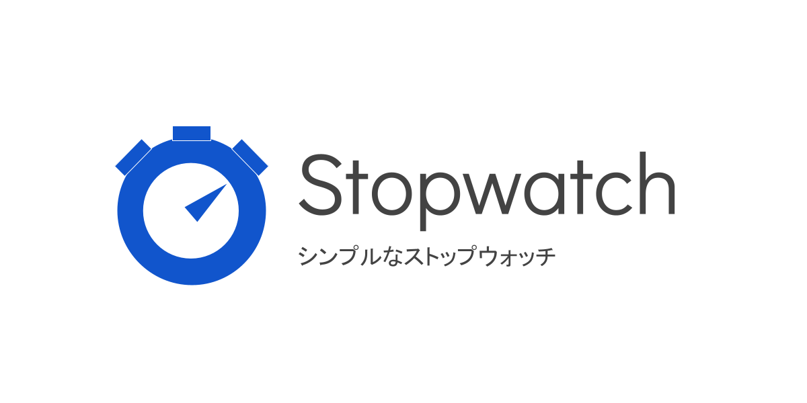

[日本語 (Japanese)](README_ja.md)
# Simple Stopwatch

[Open the App](https://r-40021.github.io/stopwatch/)

# Screenshots
### Light Mode

### Dark Mode

# Features
1. This is a very simple app and suitable for projecting this application on a large display.
2. Your device will not sleep while you are using this app.
3. You can switch between light mode and dark mode.

# Credits
- [NoSleep.js](https://github.com/richtr/NoSleep.js) Copyright (c) Rich Tibbett
- [Bootstrap Icons](https://github.com/twbs/icons/blob/main/LICENSE.md) &copy; 2019-2020 The Bootstrap Authors
